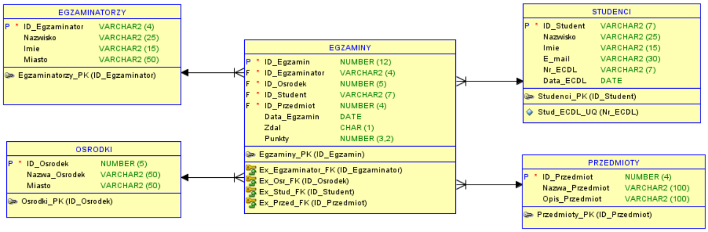
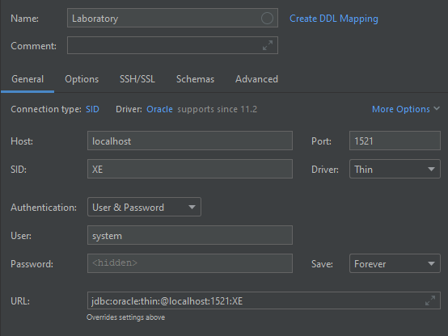

## Info

### ERD



## Environment configuration

### Creating a container with an oracle database

```
docker run -it --name oracle_docker -p 1521:1521 -e ORACLE_PASSWORD=student gvenzl/oracle-xe:21.3.0
```

### Adding a connection in DataGrip



- Connection type: `SID`
    - Driver: `Oracle`

- Host: `localhost`
    - Port: `1521`
    - SID: `XE`
    - Driver: `Thin`

- Authentication: `User & Password`
    - User: `system`
    - Password: `student`

### Setting up data

After correctly creating the container and connecting to the database, create data by executing the following `DDL` and `DML` statements:

- [create database](./lab0-setup/create_database.sql)
- [generate data](./lab0-setup/generate_data.sql)

If you need to delete all the tables use following statements:

- [delete tables](./lab0-setup/delete_tables.sql)